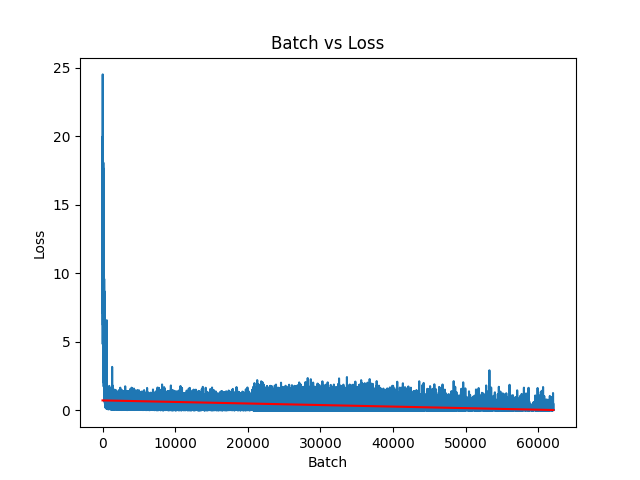

## Flan-UL2-Alpaca - [Available On HuggingFace](https://huggingface.co/coniferlabs/flan-ul2-alpaca-lora)

This repository contains code for leveraging the [Stanford Alpaca](https://github.com/tatsu-lab/stanford_alpaca) synthetic dataset to fine tune the [Flan-UL2](https://huggingface.co/google/flan-ul2) model, leveraging recent advances in instruction tuning. The Flan UL2 model has been shown to outperform Flan-T5 XXL on a number of metrics and has a 4x improvement in receptive field (2048 vs 512 tokens).

### Resource Considerations

A goal of this project was to produce this model with a limited budget demonstrating the ability train a robust, LLM using systems available to even small businesses and individuals. This had the added benefit of personally saving me money as well :). To achieve this a server was rented on [vultr.com](vultr.com) with the following pricing/specs:
- Pricing: $1.302/hour
- OS: Ubuntu 22.10 x64
- 6 vCPUs
- 60 GB CPU RAM
- 40 GB GPU RAM (1/2 x A100)

To dramatically reduce memory footprint and compute requirements [Low Rank Adaption(LoRA)](https://huggingface.co/docs/diffusers/training/lora) was used as opposed to finetuning the entire network. Additionally, the Flan-UL2 model was loaded and trained in 8 bit mode, also greatly reducing memory requirements. Finally, a batch size of 1 was used with 8 gradient accumulation steps. Here is a list of training parameters used:
- Epochs: 2
- Learning Rate: 1e-5
- Batch Size: 1
- Gradient Accumulation Steps: 8
- 8 Bit Mode: Yes


### Environment Setup

```
conda env create -f environment.yml
conda activate conifer
```

If you are running in a Unix environment and loading the model in 8 bit mode, you may encounter this error from bitsandbytes:

```
UserWarning: The installed version of bitsandbytes was compiled without GPU support. 8-bit optimizers and GPU quantization are unavailable.
```

 If that happens, [try this workaround](https://github.com/TimDettmers/bitsandbytes/issues/156#issuecomment-1462329713):

```
cd ~/miniconda3/envs/conifer/lib/python3.10/site-packages/bitsandbytes/
cp libbitsandbytes_cuda120.so libbitsandbytes_cpu.so
```

### Training

The following command will finetune the Flan-UL2 for 1 epoch. (1 epoch = ~13 hours on 1/2 x A100 [40GB VRAM])

```
python train_lora.py
```

### Usage

```
from transformers import AutoModelForSeq2SeqLM, AutoTokenizer
from peft import PeftModel, PeftConfig

prompt = "What color is the sky?"

peft_model_id = 'coniferlabs/flan-ul2-alpaca-lora'
config = PeftConfig.from_pretrained(peft_model_id)
model = AutoModelForSeq2SeqLM.from_pretrained(config.base_model_name_or_path, device_map="auto", load_in_8bit=True)
model = PeftModel.from_pretrained(model, peft_model_id, device_map={'': 0})
tokenizer = AutoTokenizer.from_pretrained(config.base_model_name_or_path)
model.eval()

tokenized_text = tokenizer.encode(prompt, return_tensors="pt").to("cuda")
outputs = model.generate(input_ids=tokenized_text, min_length=10, max_length=500)
tokenizer.batch_decode(outputs, skip_special_tokens=True)
```

### Results

| Epoch | Total Train Loss | Total Eval Loss  |
|-------|------------------|------------------|
| 1     | 12102.7285       |  2048.0518       |
| 2     | 9318.9199        |  2033.5337       |



Loss Trendline: y = -1.1302001815753724e-05x + 0.73000991550589
